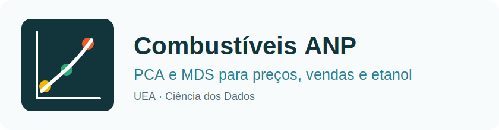

<p align="center">
  
</p>

<p align="center">
  Análise exploratória multidimensional de preços e vendas de combustíveis da ANP utilizando <strong>PCA</strong> e <strong>MDS</strong>.<br>
  <em>Projeto Acadêmico - UEA • Ciência dos Dados</em>
</p>

---

<h2 align="center">📊 Tecnologias Utilizadas</h2>

<p align="center">
  
  
  
  
  
  
  
</p>

---

<h2 align="center">📝 Descrição do Projeto</h2>

O projeto tem como objetivo aplicar técnicas de análise exploratória multidimensional em dados públicos da **ANP, Agência Nacional do Petróleo, Gás Natural e Biocombustíveis**, utilizando **PCA (Principal Component Analysis)** e **MDS (Multidimensional Scaling)**.

A análise busca compreender se a projeção dos dados em duas dimensões permite identificar **padrões regionais**, **agrupamentos**, **outliers**, **tendências** e possíveis relações entre o **preço médio da gasolina C**, o **volume vendido de gasolina C** e a possível **migração de consumo para o etanol hidratado**.

---

<h2 align="center">🎯 Problema Investigado</h2>

Uma rede de postos ou distribuidora de combustíveis precisa tomar decisões recorrentes sobre estoque, mix de produtos, campanhas comerciais e metas regionais. No entanto, a gestão observa apenas o faturamento agregado e não possui uma leitura clara da relação entre preço e volume vendido.

O problema investigado neste projeto é:

> Como as variações no preço médio da gasolina C estão associadas ao volume vendido de gasolina C e à participação do etanol hidratado nos diferentes estados brasileiros ao longo do tempo?

A análise não busca provar causalidade completa, mas identificar **associações estatísticas e padrões visuais** que possam apoiar a compreensão do comportamento do mercado de combustíveis.

---

<h2 align="center">📁 Bases de Dados Utilizadas</h2>

As bases utilizadas são públicas e disponibilizadas pela ANP:

| Base | Descrição | Finalidade no Projeto |
|---|---|---|
| **Série histórica do levantamento de preços** | Contém dados de preços médios de revenda e distribuição de combustíveis por período e localidade | Observar a variação do preço da gasolina C ao longo do tempo |
| **Vendas de derivados de petróleo e biocombustíveis** | Contém volumes vendidos em m³ por produto, mês, UF e região | Medir a demanda de gasolina C e etanol hidratado |

---

<h2 align="center">🧾 Features Analisadas</h2>

As variáveis selecionadas foram escolhidas por representarem aspectos relevantes da relação entre preço, demanda e substituição de combustível.

| Feature | Descrição | Justificativa |
|---|---|---|
| **preco_medio_gasolina_c** | Preço médio mensal da gasolina C | Variável central para observar oscilações de preço |
| **volume_gasolina_c_m3** | Volume mensal vendido de gasolina C em m³ | Representa a demanda agregada pelo combustível principal |
| **volume_etanol_hidratado_m3** | Volume mensal vendido de etanol hidratado em m³ | Permite observar possível migração de consumo |
| **variacao_preco_gasolina_c** | Variação percentual mensal do preço | Ajuda a identificar aumentos ou quedas relevantes |
| **variacao_volume_gasolina_c** | Variação percentual mensal do volume vendido | Permite analisar sensibilidade da demanda |
| **participacao_etanol** | Relação entre volume de etanol e volume total analisado | Indica o peso relativo do etanol no consumo |
| **UF** | Unidade Federativa | Utilizada como variável categórica para colorir os gráficos |
| **mes_ano** | Período da observação | Permite análise temporal dos dados |

---

<h2 align="center">🧠 Explicação Teórica</h2>

<h3>Principal Component Analysis: PCA</h3>

O **PCA** é uma técnica estatística utilizada para reduzir a dimensionalidade de um conjunto de dados numéricos. Ele transforma variáveis possivelmente correlacionadas em novas variáveis chamadas **componentes principais**.

Esses componentes são combinações lineares das variáveis originais e são organizados de forma que o primeiro componente principal explique a maior parte da variância dos dados, o segundo explique a maior parte da variância restante, e assim por diante.

Neste projeto, o PCA é utilizado para:

- Projetar os dados multidimensionais em duas dimensões;
- Verificar se existem agrupamentos entre estados ou períodos;
- Identificar possíveis outliers;
- Avaliar quais variáveis mais influenciam os primeiros componentes principais;
- Verificar se os dois primeiros componentes explicam uma parcela relevante da variância dos dados.

<h3>Multidimensional Scaling: MDS</h3>

O **MDS** é uma técnica de visualização que busca representar, em poucas dimensões, as relações de proximidade ou distância entre os registros de um conjunto de dados.

Diferentemente do PCA, que se baseia na variância das variáveis, o MDS trabalha com uma matriz de distâncias entre os pontos. O objetivo é posicionar registros semelhantes próximos entre si e registros diferentes mais distantes no gráfico.

Neste projeto, o MDS é utilizado para:

- Observar a similaridade entre estados e períodos;
- Identificar grupos de registros com comportamento parecido;
- Comparar os padrões encontrados com os resultados do PCA;
- Apoiar a interpretação visual de possíveis outliers e agrupamentos.

---

<h2 align="center">⚙️ Preparação dos Dados</h2>

Antes da aplicação das técnicas, os dados passam pelas seguintes etapas:

1. Carregamento das bases públicas da ANP;
2. Padronização dos nomes das colunas;
3. Seleção dos combustíveis de interesse: gasolina C e etanol hidratado;
4. Agregação dos dados por mês e Unidade Federativa;
5. Cruzamento entre dados de preço e volume vendido (por mês e UF, com rotulagem de região normalizada entre as fontes para incluir todas as UFs);
6. Criação de variáveis derivadas;
7. Tratamento de valores ausentes;
8. Seleção das features numéricas;
9. Padronização dos dados com `StandardScaler`.

A padronização é necessária porque as variáveis possuem escalas diferentes, como preço em reais e volume em metros cúbicos. Sem essa etapa, variáveis com valores absolutos maiores poderiam dominar indevidamente os resultados.

---

<h2 align="center">📉 Aplicação do PCA</h2>

A aplicação do PCA será realizada com os seguintes objetivos:

| Etapa | Descrição |
|---|---|
| **Redução para 2 componentes** | Projetar os dados em um gráfico bidimensional |
| **Análise da variância explicada** | Verificar quanto da informação original é preservada |
| **Análise das cargas dos componentes** | Identificar quais variáveis mais influenciam PC1 e PC2 |
| **Visualização por UF** | Observar possíveis padrões regionais |
| **Identificação de outliers** | Verificar registros muito afastados dos demais |

A interpretação do PCA será feita com base na posição dos pontos no gráfico, na variância explicada e na contribuição das variáveis para os componentes principais.

---

<h2 align="center">📌 Aplicação do MDS</h2>

A aplicação do MDS será realizada para complementar a análise visual dos dados.

| Etapa | Descrição |
|---|---|
| **Cálculo das distâncias** | Medir a dissimilaridade entre os registros |
| **Projeção em 2D** | Representar os dados em duas dimensões |
| **Visualização por UF** | Observar estados ou períodos com comportamento semelhante |
| **Análise de agrupamentos** | Identificar registros próximos entre si |
| **Análise de outliers** | Verificar registros visualmente isolados |

O MDS será usado principalmente como técnica de visualização, permitindo comparar se os padrões observados são semelhantes aos encontrados no PCA.

---

<h2 align="center">🔍 Comparação entre PCA e MDS</h2>

| Critério | PCA | MDS |
|---|---|---|
| Base matemática | Variância dos dados | Distâncias entre registros |
| Objetivo principal | Redução de dimensionalidade | Visualização de similaridades |
| Interpretação das variáveis | Permite analisar contribuição das features | Não mostra diretamente contribuição das variáveis |
| Uso no projeto | Avaliar variância, componentes e influência das variáveis | Observar proximidades, grupos e outliers |
| Aplicação para redução de features | Mais adequado | Menos adequado |

O PCA pode apoiar uma possível redução de features em etapas futuras, enquanto o MDS é mais adequado para visualização exploratória das relações entre os registros.

---

<h2 align="center">📁 Estrutura do Projeto</h2>

```text
analise-combustiveis-anp-pca-mds/
├── data/
│   ├── raw/                         # Bases originais da ANP
│   ├── processed/                   # Bases tratadas para análise
│   └── README.md                    # Descrição das fontes de dados
├── notebooks/
│   └── analise_pca_mds_anp.ipynb    # Notebook principal da atividade
├── src/
│   ├── data_preparation.py          # Funções de limpeza e preparação dos dados
│   ├── pca_analysis.py              # Aplicação e visualização do PCA
│   └── mds_analysis.py              # Aplicação e visualização do MDS
├── docs/
│   ├── report/                      # Relatório curto da atividade
│   ├── slides/                      # Apresentação oral do grupo
│   └── diagrams/
│       └── logo.svg                 # Logo do projeto
├── outputs/
│   ├── figures/                     # Gráficos gerados
│   └── tables/                      # Tabelas de resultados
├── requirements.txt
└── README.md
````

---

<h2 align="center">▶️ Como Executar o Projeto</h2>

### 1. Clonar o repositório

```bash
git clone https://github.com/JulianaBallin/analise-combustiveis-anp-pca-mds.git
cd analise-combustiveis-anp-pca-mds
```

### 2. Criar ambiente virtual

```bash
python -m venv .venv
source .venv/bin/activate        # Linux/Mac
# .venv\Scripts\activate         # Windows
```

### 3. Instalar dependências

```bash
pip install -r requirements.txt
```

### 4. Gerar todos os entregáveis

```bash
python run_analysis.py
```

Esse comando baixa as bases oficiais da ANP, prepara o dataset (`merge` por **`mes_ano` + sigla `uf`**, sem depender do texto idêntico de `uf_nome` entre fontes — isso evitava perder **~240** linhas em DF, GO, MS e MT quando Centro-Oeste grafava diferente nas duas bases), executa PCA e MDS e gera tabelas, gráficos, relatório e slides. O MDS usa parâmetros alinhados ao **scikit-learn 1.7+** (`metric`, `dissimilarity`, `normalized_stress`).

### 5. Executar o notebook

```bash
jupyter notebook notebooks/analise_pca_mds_anp.ipynb
```

---

<h2 align="center">📦 Dependências Principais</h2>

```txt
pandas
numpy
scikit-learn
matplotlib
seaborn
jupyter
openpyxl
python-pptx
reportlab
```

---

<h2 align="center">📌 Entregáveis da Atividade</h2>

| Entregável | Arquivo |
|---|---|
| Relatório curto | `docs/report/relatorio_pca_mds_anp.md` e `docs/report/relatorio_pca_mds_anp.pdf` |
| Notebook | `notebooks/analise_pca_mds_anp.ipynb` |
| Código reprodutível | `run_analysis.py` e módulos em `src/` |
| Dataset tratado | `data/processed/dataset_anp_pca_mds_2021_2025.csv` |
| Gráficos | `outputs/figures/` |
| Tabelas de apoio | `outputs/tables/` |
| Slides | `docs/slides/apresentacao_pca_mds_anp.pdf` |

Principais resultados do recorte 2021-2025 (27 UFs, 1619 registros UF-mês após o join corrigido mês+UF e alinhamento do PCA atual):

* Os dois primeiros componentes do PCA explicaram **cerca de 57,5%** da variância total.
* O PC1 foi mais influenciado por participação do etanol, razão etanol/gasolina, volume de etanol e preço relativo etanol/gasolina.
* O PC2 foi mais influenciado por variação mensal de preço da gasolina, volume de gasolina, variação mensal de volume e preço médio da gasolina C.
* São Paulo segue entre os principais outliers por combinar escala muito alta de vendas e elevada participação do etanol.

---

<h2 align="center">📊 Resultados Esperados</h2>

Ao final da análise, espera-se identificar:

* Estados ou períodos com comportamento semelhante de preço e venda;
* Possíveis agrupamentos regionais;
* Outliers relacionados a grandes variações de preço ou volume;
* Variáveis que mais influenciam os componentes principais do PCA;
* Diferenças e semelhanças entre os padrões revelados por PCA e MDS;
* Indícios de substituição entre gasolina C e etanol hidratado;
* Possibilidades de redução de features para análises futuras.

---

<h2 align="center">⚠️ Limitações da Análise</h2>

* As bases da ANP são agregadas e não representam o comportamento individual dos consumidores;
* A análise observa associação entre preço e volume, mas não prova causalidade;
* Fatores externos como renda, frota, inflação, clima, promoções e câmbio não estão incluídos nesta etapa;
* Mudanças metodológicas e regulatórias podem afetar a comparação histórica;
* A projeção em duas dimensões pode simplificar relações complexas dos dados originais;
* A interpretação visual dos gráficos deve ser feita com cautela.

---

<h2 align="center">📚 Referências</h2>

* ANP. Série histórica do levantamento de preços.
* ANP. Vendas de derivados de petróleo e biocombustíveis.
* ANP. Metadados das bases públicas de preços e vendas de combustíveis.
* Scikit-learn. Documentação oficial dos métodos PCA e MDS.

---

<h2 align="center">👥 Equipe</h2>

<p align="center">

| Nome                          |
| ----------------------------- |
| Ana Beatriz Maciel Nunes      |
| Fernando Luiz Da Silva Freire |
| Juliana Ballin Lima           |

</p>

---

<h3 align="center">UEA • Ciência dos Dados • Análise de Combustíveis ANP com PCA e MDS</h3>
